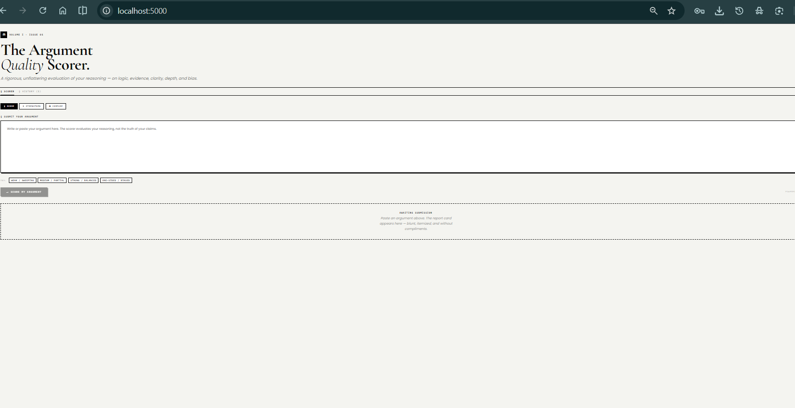
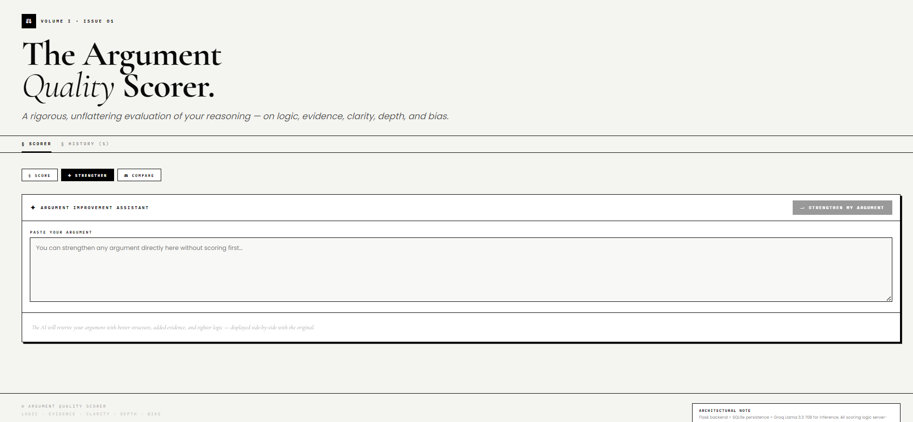
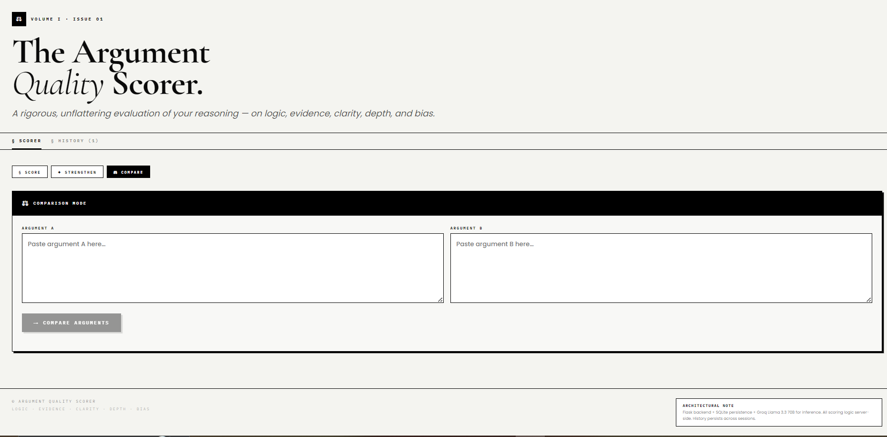
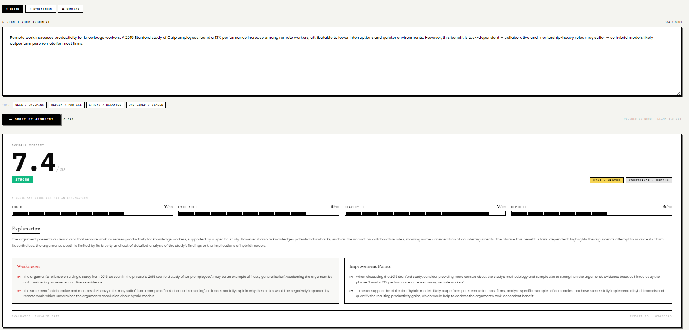
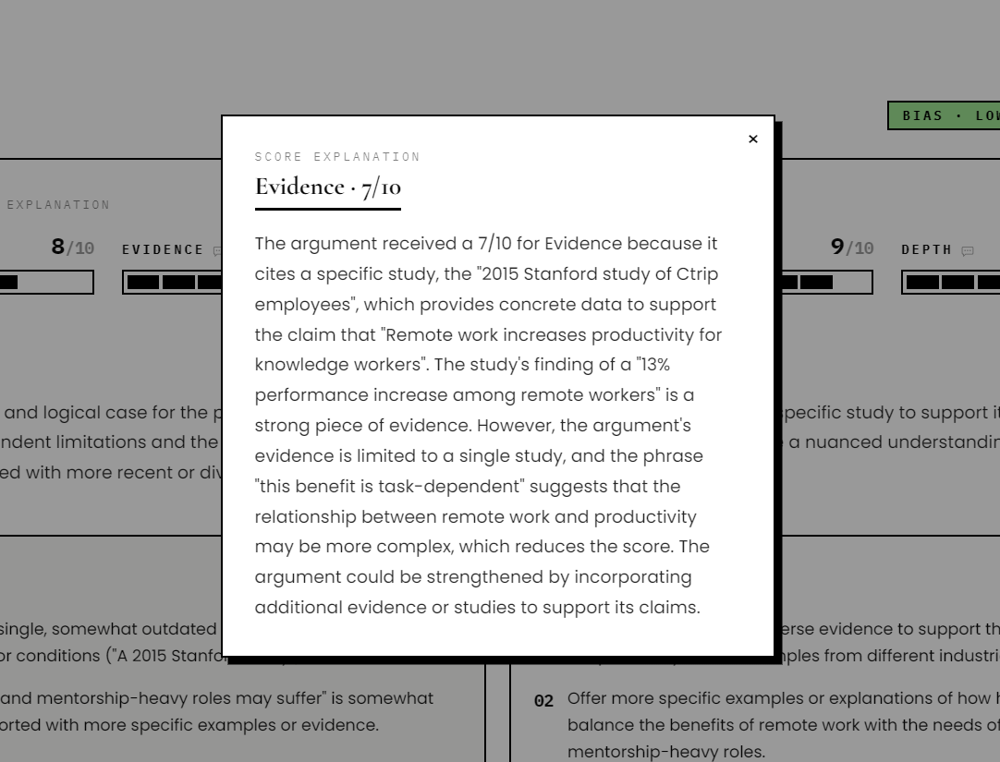
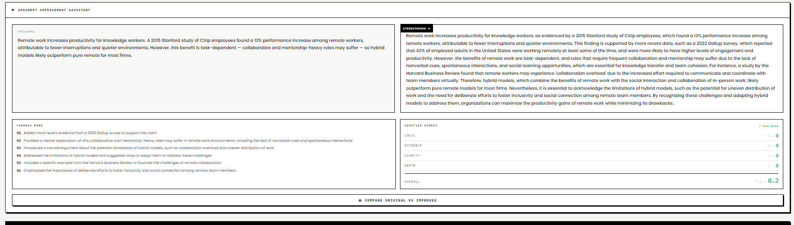
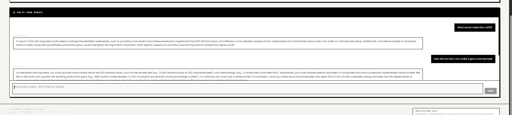
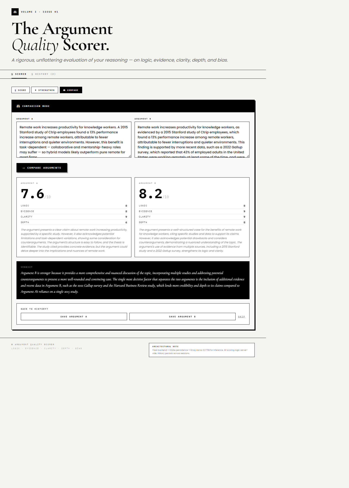
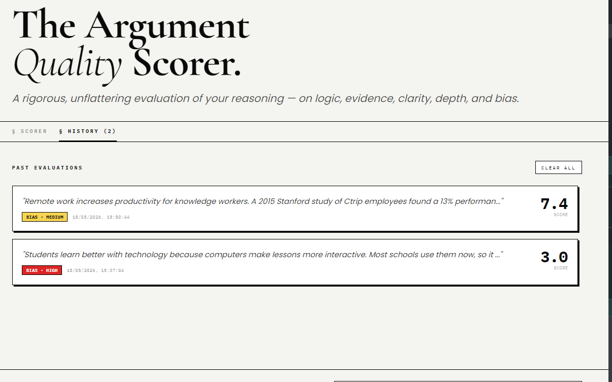

# ArgusScorer — Argument Quality Scorer

> *A rigorous, unflattering evaluation of your reasoning — on logic, evidence, clarity, depth, and bias.*

ArgusScorer is a **full-stack web application** that uses AI to analyze and score written arguments across five critical dimensions. It helps students, debaters, researchers and writers identify logical flaws, weak evidence, and bias in their reasoning — and then automatically rewrites their argument to a higher standard.

---

## 🖼️ Screenshots


### Argument Scorer Interface

*Complete interface overview*

### Strengthen Argument

*Visual workflow for strengthening arguments*

### Comparison Page

*Argument comparison visuals*

### Scoring Result

*Input argument and view generated score*

### Dimension

*Showing Argument , dimension and value*

### Strengthen 

*AI rewrites weak argument, then improves argument *


### multi debate 

*Real-time chat interface to challenge scores and receive specific, actionable suggestions for improving evidence and logic*


### Head-to-Head Analysis:

*Side-by-side scoring of two arguments with a decisive verdict, highlighting the winner based on depth and evidence quality.*

### History Log:

*Displays saved evaluations with scores and bias indicators (Low/Medium/High), allowing users to track and reload past arguments.*


---

## 🔍 What is ArgusScorer?

Most writing tools tell you *how* to write better — fix your grammar, vary your sentence length, add transitions. ArgusScorer does something different: it tells you *why your reasoning is weak* and gives you a score breakdown with specific, quoted evidence from your own argument.

It is built around a simple idea: **a well-written argument is worthless if the logic is bad.** ArgusScorer forces you to confront that.

### Who is it for?

- **Students** submitting essays, debate prep, or critical thinking assignments
- **Researchers** stress-testing their claims before peer review
- **Debaters** identifying weaknesses an opponent would exploit
- **Anyone** who wants to think and write more rigorously

---

## ❓ Why This Project?

Most AI writing tools are designed to validate you. They suggest synonyms, improve flow, and make your writing sound more confident — regardless of whether your argument actually holds up.

ArgusScorer was built to do the opposite: to be the harshest, most honest reviewer you can have before a real audience sees your work. It evaluates **reasoning quality**, not surface-level writing quality.

The evaluation is also **transparent** — every weakness is quoted directly from your text, every score has a clickable explanation, and the "Strengthen" feature shows exactly what changed and why.

---

## ⚙️ How It Works

ArgusScorer is a **full-stack application** using a Python Flask backend and a React frontend. The server handles the AI logic and data persistence, while the browser handles the user interface.

### Tech Stack

| Layer | Technology |
|---|---|
| **Backend** | Python (Flask) |
| **Database** | SQLite (File-based, Zero Config) |
| **Frontend** | React 18 (UMD, no build step) |
| **AI Inference** | Groq API — `llama-3.3-70b-versatile` |
| **Styling** | Inline CSS + Google Fonts |
| **Environment** | `.env` (For API Keys) |

### Why Flask + SQLite?

1.  **Security:** Your API key is stored on the server (`.env`), never exposed to the browser.
2.  **Persistence:** Evaluations are saved in a local SQLite database (`argus_scorer.db`), so history survives browser restarts and server restarts.
3.  **Performance:** Flask is lightweight and fast, perfect for handling AI API requests without the bloat of larger frameworks.

---

## 🔄 Workflow / Feature Walkthrough

### 1. Score Tab (`§ Score`)

**Input → Evaluate → Report**

1.  Paste or type your argument (10 – 8,000 characters)
2.  Click **→ Score my argument**
3.  Receive a full report card:

| Dimension | What it measures |
|---|---|
| **Logic** | Are conclusions actually supported by the premises? |
| **Evidence** | Are there named studies, statistics, or concrete examples? |
| **Clarity** | Is the thesis identifiable? Is the structure followable? |
| **Depth** | Does it engage with counterarguments and nuance? |
| **Bias** | Does it acknowledge opposing views fairly? |

-   **Overall score** = weighted average of all five dimensions (bias included)
-   Click any score bar to get a **2-3 sentence explanation** of exactly why that score was given, with quotes from your text
-   **Weaknesses** section quotes your actual phrasing and names the logical flaw type
-   **Improvement Points** give concrete, actionable instructions targeting specific claims
-   **Auto-Save:** Results are automatically saved to the SQLite database.

---

### 2. Strengthen Tab (`✦ Strengthen`)

**Rewrite → Verify with Real Score**

1.  After scoring, click **→ Strengthen My Argument**
2.  The backend sends the argument to the AI to rewrite it, targeting the scoring rubric:
    -   Adds named studies or documented real-world cases (evidence ≥ 6)
    -   Makes causal chains explicit: *If X then Y, because Z* (logic ≥ 7)
    -   Addresses counterarguments with reasoning, not dismissal (depth ≥ 7, bias → Low)
3.  The improved argument is displayed **side-by-side** with your original
4.  A **second automatic API call** re-scores the improved version with verified real scores — not AI estimates
5.  Score changes are shown in green (improvement) or red (regression)

> You can also use this tab **without scoring first** — paste any argument directly.

---

### 3. Compare Tab (`⚖ Compare`)

**Head-to-head argument evaluation**

1.  Paste two arguments (yours vs. a peer's, two drafts, etc.)
2.  Both are scored simultaneously via parallel backend requests
3.  A **judge verdict** is generated: which argument wins and why, in exactly 2 sentences
4.  You can choose to save either argument to the database history or skip saving.

---

### 4. History Tab (`§ History`)

-   Every scored argument is automatically saved to the **SQLite database**.
-   History is persistent — it remains even if you close the browser or restart the server.
-   Up to 100 entries stored in the database.
-   Click any entry to reload the full report.
-   Source label shows whether it came from direct scoring or compare mode.
-   Clear all history with one click (deletes from database).

---

### 5. Debate Chat (`⚔ Multi-Turn Debate`)

After scoring, a debate panel appears below the report:

-   Challenge any weakness: *"I disagree with weakness #1"*
-   Dispute a score: *"Why is my evidence score so low?"*
-   Ask for improvement paths: *"What would make this a 9/10?"*

The AI (via the backend) has full context of your argument and scores. It will concede valid points and defend justified scores — no sycophancy.

---

## 🚀 Getting Started

### Prerequisites

-   **Python 3.8+** installed on your machine.
-   A free Groq API key: [console.groq.com/keys](https://console.groq.com/keys) — no credit card required
-   A modern browser (Chrome, Firefox, Edge, Safari)

### Running the App

```bash
# #1. Download the repository
# Go to GitHub → Click "Code" → "Download ZIP"
# Extract the ZIP file and open the folder
cd argus-scorer

# 2. Install Python dependencies
pip install -r requirements.txt

# 3. Set up your API Key
# Create a file named '.env' and add your key:
# GROQ_API_KEY=gsk_your_actual_key_here

# 4. Run the Flask Server
python app.py

# 5. Open in Browser
# The app will be available at http://localhost:5000

##6. 🔗 Live Demo

**[Click here to use ArgusScorer](https://argument-qaulity-scorer.up.railway.app)**

No setup required — works on any device.
```

> **Security Note:** Your API key is stored in the `.env` file on the server. It is **never sent** to the frontend browser, ensuring it remains secure even on public networks.

---

## 📁 Project Structure

```text
argus-scorer/
├── app.py              # Flask Backend - API Routes & Logic
├── database.py         # SQLite Helpers - Database Operations
├── index.html          # React Frontend - UI Components
├── requirements.txt    # Python Dependencies
├── .env                # Environment Variables (API Key) - Do not commit this!
├── argus_scorer.db     # SQLite Database (Auto-created on first run)
└── README.md           # This file
```

---

## 🧠 Scoring Rubric (How the AI Judges)

The scorer uses a strict rule-based prompt. Key mandatory rules:

```
No named studies or statistics        → evidence MUST be ≤ 3
Weak or absent causal reasoning       → logic MUST be ≤ 4
Only one perspective considered       → bias CANNOT be "Low"
Sweeping generalizations              → bias = "High"
Short or underdeveloped argument      → depth MUST be ≤ 4
```

Every weakness must quote or paraphrase a specific phrase from the argument and name the exact logical flaw type (e.g., *hasty generalization*, *circular reasoning*, *appeal to popularity*).

---

## 🛠️ Known Limitations

-   **Server Required:** Unlike the previous version, this requires Python and a running server (`python app.py`).
-   **Groq rate limits:** Free tier has request limits; heavy use may hit them.
-   **SQLite Concurrency:** SQLite is file-based. While perfect for single-user or small group use, it is not designed for high-traffic concurrent production environments (switch to PostgreSQL for scale).
-   **Model Hallucination:** AI may cite plausible-sounding but non-existent studies in Strengthen output. Always verify sources.
-   **No User Accounts:** History is local to the database instance; there are no login/user systems (suitable for personal or coursework use).

---

## 📄 License

This project was developed as an academic submission. All AI inference is performed via Groq API using the Llama 3.3 70B model.

---

## 👤 Author

Developed as part of a coursework project.  
Powered by [Groq](https://groq.com) · [Llama 3.3 70B](https://www.llama.com) · [Flask](https://flask.palletsprojects.com) · [React 18](https://react.dev)

---

*Built for those who value precision, logic, and clear thinking.*
